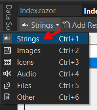
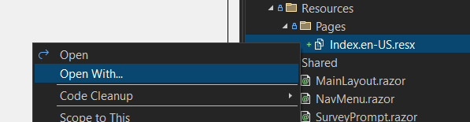
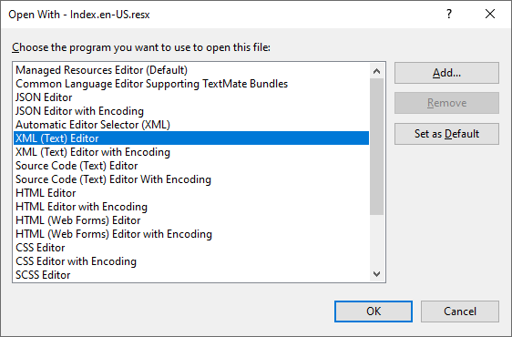
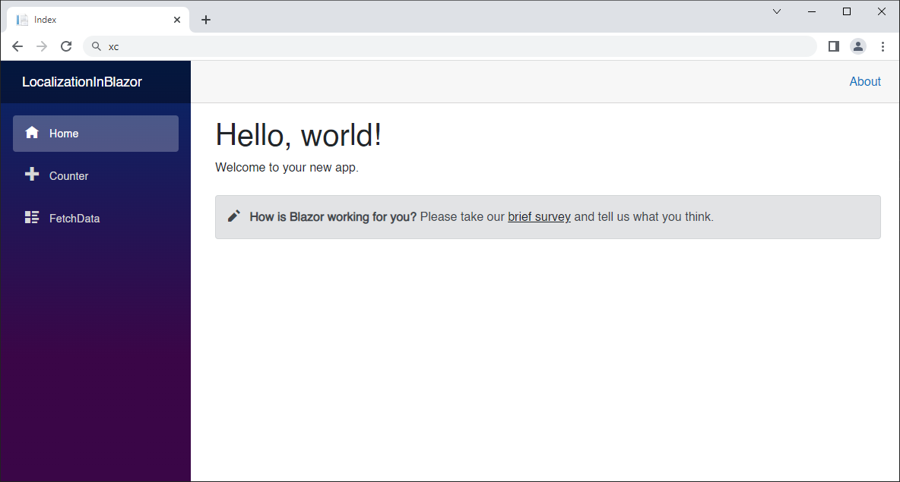
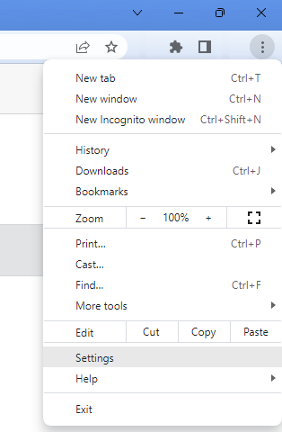
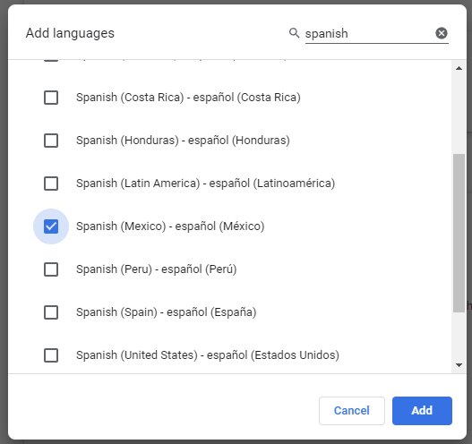
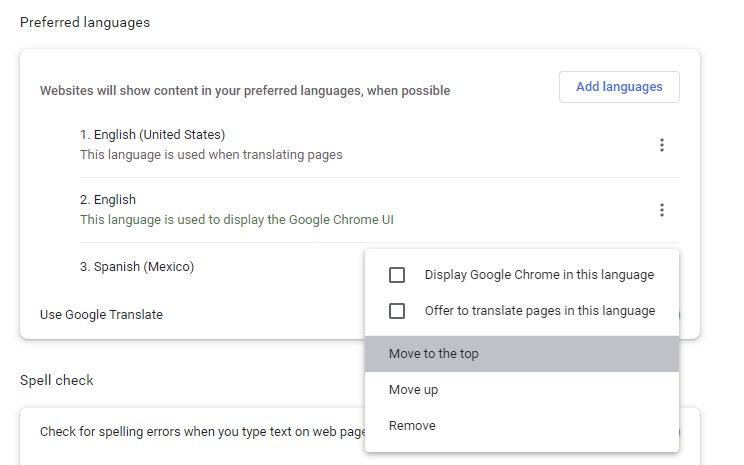
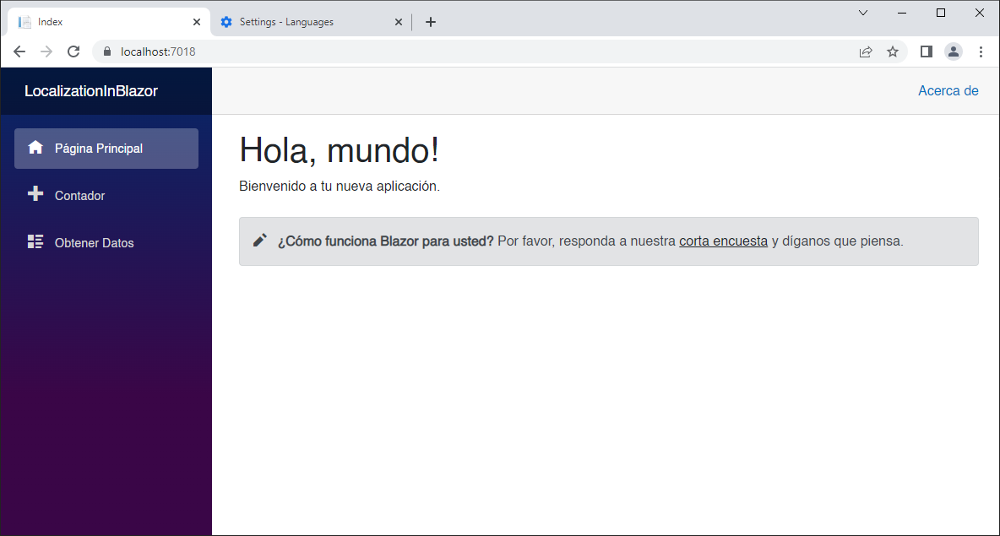
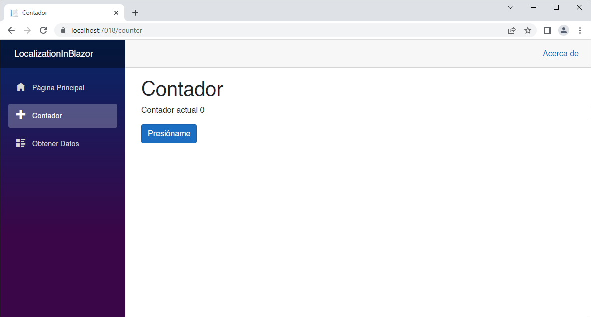
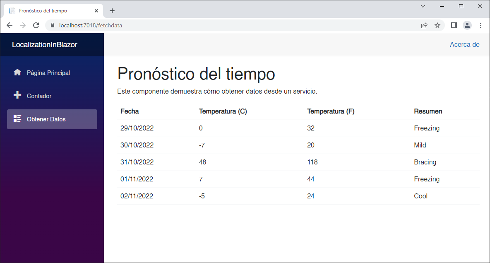

# Localization in Blazor

In this episode, we are going to build a **Blazor WebAssembly** application, and we are going to add localization support.

We will make use of the **Microsoft.Extensions.Localization NuGet** package, to leverage localization services, such as the **AddLocalization** service, and the **IStringLocalizer** interface.

At the end of the demo, we will have the default **Blazor** template application, with support for English and Spanish.

Let's get to it.

### Create a Blazor Application

Create a new **Hosted Blazor WebAssembly** project called **LocalizationDemo**.

All of the changes we will make will be to the **LocalizationDemo.Client** app. No configuration changes are required on the server side.

We are going to set the application's culture, and in order to use that we need the **Microsoft.Extensions.Localization NuGet** package.

Add the [Microsoft.Extensions.Localization](https://www.nuget.org/packages/Microsoft.Extensions.Localization,) by running the following command in the **Package Manager Console** against the **LocalizationDemo.Client** project.

```powershell
Install-Package Microsoft.Extensions.Localization
```

Alternatively, you can add this package reference in your *LocalizationInBlazor.Client.csproj* file:

```xml
<PackageReference Include="Microsoft.Extensions.Localization" Version="6.0.10" />
```

Now we are going to add localization services to the server application by adding the `AddLocalization` middleware.

Open the *Program.cs* file, and add  the following at line 6 after the line `var builder = WebAssemblyHostBuilder.CreateDefault(args);`

```c#
builder.Services.AddLocalization();
```

We need a place to store our resource files in different languages. In our demo we will support two languages: English and Spanish. There are a couple of ways to do that, and some naming conventions we have to follow, depending on each case.

We can create the resource files under the *Pages* folder, side-by-side with the **Razor** pages we want translated, in this case the file names should be the same as each **Razor** page but with the folder they are located at pre-appended, and language appended to it, plus the **.resx** extension.

For example, if we want to add a resource file for *Index.razor*, the resource file names would be *Pages.Index.en-US.resx* for English, and *Pages.Index.es-MX.resx* for Spanish.

Another option would be to create a new *Resources* folder, then mimic the folder structure of your pages. In this demo, we want to translate the **Razor** pages under the *Pages* folder, so we need to create a *Pages* folder inside the *Resources* folder.

Then we need to specify the location of the *Resources* folder in *Program.cs*, by setting the **ResourcesPath** option, when calling `builder.Services.AddLocalization`. In this case, the files do not need the **Pages** prefix. For example, if we want to add a resource file for *Index.razor*, the resource file names would be *Index.en-US.resx* for English, and *Index.es-MX.resx* for Spanish. 

I like the second approach better, so let's do that.

Create a *Resources* folder at the root level, and then a *Pages* folder inside of it. Then, right-click on the *Pages* folder, and add a new *Resource* file for English, and call it *Index.en-US.resx*.

  

  

The file will be displayed in the **Resource** editor, with one String resource by default.

  

You can delete the default resource, or rename it. We are going to add all the English resource strings we need to display our application's **Index** page in English. Add all the following resources.

:note: Add these values manually, as resource strings, to get familiar with the UI, but I will provide the actual **XML** of the resource files, so you can just copy and paste.

  


| Name              | Value                          |
| ----------------- | ------------------------------ |
| HomeTitle         | Hello, world!                  |
| HomeSubtitle      | Welcome to your new app.       |
| SurveyPromptTitle | How is Blazor working for you? |

Resources should look like this:

  

Resource files are nothing but **XML** files, in order to view the code, right-click on the resource file, and select **Open With** from the menu.

  

Then click on **XML (Text) Editor**, and then OK.

 

You should be able to see the **XML** resource file, as shown below.

```xml
<?xml version="1.0" encoding="utf-8"?>
<root>
  <!-- 
    Microsoft ResX Schema 
    
    Version 2.0
    
    The primary goals of this format is to allow a simple XML format 
    that is mostly human readable. The generation and parsing of the 
    various data types are done through the TypeConverter classes 
    associated with the data types.
    
    Example:
    
    ... ado.net/XML headers & schema ...
    <resheader name="resmimetype">text/microsoft-resx</resheader>
    <resheader name="version">2.0</resheader>
    <resheader name="reader">System.Resources.ResXResourceReader, System.Windows.Forms, ...</resheader>
    <resheader name="writer">System.Resources.ResXResourceWriter, System.Windows.Forms, ...</resheader>
    <data name="Name1"><value>this is my long string</value><comment>this is a comment</comment></data>
    <data name="Color1" type="System.Drawing.Color, System.Drawing">Blue</data>
    <data name="Bitmap1" mimetype="application/x-microsoft.net.object.binary.base64">
        <value>[base64 mime encoded serialized .NET Framework object]</value>
    </data>
    <data name="Icon1" type="System.Drawing.Icon, System.Drawing" mimetype="application/x-microsoft.net.object.bytearray.base64">
        <value>[base64 mime encoded string representing a byte array form of the .NET Framework object]</value>
        <comment>This is a comment</comment>
    </data>
                
    There are any number of "resheader" rows that contain simple 
    name/value pairs.
    
    Each data row contains a name, and value. The row also contains a 
    type or mimetype. Type corresponds to a .NET class that support 
    text/value conversion through the TypeConverter architecture. 
    Classes that don't support this are serialized and stored with the 
    mimetype set.
    
    The mimetype is used for serialized objects, and tells the 
    ResXResourceReader how to depersist the object. This is currently not 
    extensible. For a given mimetype the value must be set accordingly:
    
    Note - application/x-microsoft.net.object.binary.base64 is the format 
    that the ResXResourceWriter will generate, however the reader can 
    read any of the formats listed below.
    
    mimetype: application/x-microsoft.net.object.binary.base64
    value   : The object must be serialized with 
            : System.Runtime.Serialization.Formatters.Binary.BinaryFormatter
            : and then encoded with base64 encoding.
    
    mimetype: application/x-microsoft.net.object.soap.base64
    value   : The object must be serialized with 
            : System.Runtime.Serialization.Formatters.Soap.SoapFormatter
            : and then encoded with base64 encoding.

    mimetype: application/x-microsoft.net.object.bytearray.base64
    value   : The object must be serialized into a byte array 
            : using a System.ComponentModel.TypeConverter
            : and then encoded with base64 encoding.
    -->
  <xsd:schema id="root" xmlns="" xmlns:xsd="http://www.w3.org/2001/XMLSchema" xmlns:msdata="urn:schemas-microsoft-com:xml-msdata">
    <xsd:import namespace="http://www.w3.org/XML/1998/namespace" />
    <xsd:element name="root" msdata:IsDataSet="true">
      <xsd:complexType>
        <xsd:choice maxOccurs="unbounded">
          <xsd:element name="metadata">
            <xsd:complexType>
              <xsd:sequence>
                <xsd:element name="value" type="xsd:string" minOccurs="0" />
              </xsd:sequence>
              <xsd:attribute name="name" use="required" type="xsd:string" />
              <xsd:attribute name="type" type="xsd:string" />
              <xsd:attribute name="mimetype" type="xsd:string" />
              <xsd:attribute ref="xml:space" />
            </xsd:complexType>
          </xsd:element>
          <xsd:element name="assembly">
            <xsd:complexType>
              <xsd:attribute name="alias" type="xsd:string" />
              <xsd:attribute name="name" type="xsd:string" />
            </xsd:complexType>
          </xsd:element>
          <xsd:element name="data">
            <xsd:complexType>
              <xsd:sequence>
                <xsd:element name="value" type="xsd:string" minOccurs="0" msdata:Ordinal="1" />
                <xsd:element name="comment" type="xsd:string" minOccurs="0" msdata:Ordinal="2" />
              </xsd:sequence>
              <xsd:attribute name="name" type="xsd:string" use="required" msdata:Ordinal="1" />
              <xsd:attribute name="type" type="xsd:string" msdata:Ordinal="3" />
              <xsd:attribute name="mimetype" type="xsd:string" msdata:Ordinal="4" />
              <xsd:attribute ref="xml:space" />
            </xsd:complexType>
          </xsd:element>
          <xsd:element name="resheader">
            <xsd:complexType>
              <xsd:sequence>
                <xsd:element name="value" type="xsd:string" minOccurs="0" msdata:Ordinal="1" />
              </xsd:sequence>
              <xsd:attribute name="name" type="xsd:string" use="required" />
            </xsd:complexType>
          </xsd:element>
        </xsd:choice>
      </xsd:complexType>
    </xsd:element>
  </xsd:schema>
  <resheader name="resmimetype">
    <value>text/microsoft-resx</value>
  </resheader>
  <resheader name="version">
    <value>2.0</value>
  </resheader>
  <resheader name="reader">
    <value>System.Resources.ResXResourceReader, System.Windows.Forms, Version=4.0.0.0, Culture=neutral, PublicKeyToken=b77a5c561934e089</value>
  </resheader>
  <resheader name="writer">
    <value>System.Resources.ResXResourceWriter, System.Windows.Forms, Version=4.0.0.0, Culture=neutral, PublicKeyToken=b77a5c561934e089</value>
  </resheader>
  <data name="HomeSubtitle" xml:space="preserve">
    <value>Welcome to your new app.</value>
  </data>
  <data name="HomeTitle" xml:space="preserve">
    <value>Hello, world!</value>
  </data>
  <data name="SurveyPromptTitle" xml:space="preserve">
    <value>How is Blazor working for you?</value>
  </data>
</root>
```

Now, let's add the resource strings we are going to need for Spanish. Duplicate the *Index.en-US.resx* file.

  

Then rename it to *Index.es-MX.resx*, open the file with the **XML (Text)** editor, and replace the contents with the following code:

```xml
<?xml version="1.0" encoding="utf-8"?>
<root>
  <!-- 
    Microsoft ResX Schema 
    
    Version 2.0
    
    The primary goals of this format is to allow a simple XML format 
    that is mostly human readable. The generation and parsing of the 
    various data types are done through the TypeConverter classes 
    associated with the data types.
    
    Example:
    
    ... ado.net/XML headers & schema ...
    <resheader name="resmimetype">text/microsoft-resx</resheader>
    <resheader name="version">2.0</resheader>
    <resheader name="reader">System.Resources.ResXResourceReader, System.Windows.Forms, ...</resheader>
    <resheader name="writer">System.Resources.ResXResourceWriter, System.Windows.Forms, ...</resheader>
    <data name="Name1"><value>this is my long string</value><comment>this is a comment</comment></data>
    <data name="Color1" type="System.Drawing.Color, System.Drawing">Blue</data>
    <data name="Bitmap1" mimetype="application/x-microsoft.net.object.binary.base64">
        <value>[base64 mime encoded serialized .NET Framework object]</value>
    </data>
    <data name="Icon1" type="System.Drawing.Icon, System.Drawing" mimetype="application/x-microsoft.net.object.bytearray.base64">
        <value>[base64 mime encoded string representing a byte array form of the .NET Framework object]</value>
        <comment>This is a comment</comment>
    </data>
                
    There are any number of "resheader" rows that contain simple 
    name/value pairs.
    
    Each data row contains a name, and value. The row also contains a 
    type or mimetype. Type corresponds to a .NET class that support 
    text/value conversion through the TypeConverter architecture. 
    Classes that don't support this are serialized and stored with the 
    mimetype set.
    
    The mimetype is used for serialized objects, and tells the 
    ResXResourceReader how to depersist the object. This is currently not 
    extensible. For a given mimetype the value must be set accordingly:
    
    Note - application/x-microsoft.net.object.binary.base64 is the format 
    that the ResXResourceWriter will generate, however the reader can 
    read any of the formats listed below.
    
    mimetype: application/x-microsoft.net.object.binary.base64
    value   : The object must be serialized with 
            : System.Runtime.Serialization.Formatters.Binary.BinaryFormatter
            : and then encoded with base64 encoding.
    
    mimetype: application/x-microsoft.net.object.soap.base64
    value   : The object must be serialized with 
            : System.Runtime.Serialization.Formatters.Soap.SoapFormatter
            : and then encoded with base64 encoding.

    mimetype: application/x-microsoft.net.object.bytearray.base64
    value   : The object must be serialized into a byte array 
            : using a System.ComponentModel.TypeConverter
            : and then encoded with base64 encoding.
    -->
  <xsd:schema id="root" xmlns="" xmlns:xsd="http://www.w3.org/2001/XMLSchema" xmlns:msdata="urn:schemas-microsoft-com:xml-msdata">
    <xsd:import namespace="http://www.w3.org/XML/1998/namespace" />
    <xsd:element name="root" msdata:IsDataSet="true">
      <xsd:complexType>
        <xsd:choice maxOccurs="unbounded">
          <xsd:element name="metadata">
            <xsd:complexType>
              <xsd:sequence>
                <xsd:element name="value" type="xsd:string" minOccurs="0" />
              </xsd:sequence>
              <xsd:attribute name="name" use="required" type="xsd:string" />
              <xsd:attribute name="type" type="xsd:string" />
              <xsd:attribute name="mimetype" type="xsd:string" />
              <xsd:attribute ref="xml:space" />
            </xsd:complexType>
          </xsd:element>
          <xsd:element name="assembly">
            <xsd:complexType>
              <xsd:attribute name="alias" type="xsd:string" />
              <xsd:attribute name="name" type="xsd:string" />
            </xsd:complexType>
          </xsd:element>
          <xsd:element name="data">
            <xsd:complexType>
              <xsd:sequence>
                <xsd:element name="value" type="xsd:string" minOccurs="0" msdata:Ordinal="1" />
                <xsd:element name="comment" type="xsd:string" minOccurs="0" msdata:Ordinal="2" />
              </xsd:sequence>
              <xsd:attribute name="name" type="xsd:string" use="required" msdata:Ordinal="1" />
              <xsd:attribute name="type" type="xsd:string" msdata:Ordinal="3" />
              <xsd:attribute name="mimetype" type="xsd:string" msdata:Ordinal="4" />
              <xsd:attribute ref="xml:space" />
            </xsd:complexType>
          </xsd:element>
          <xsd:element name="resheader">
            <xsd:complexType>
              <xsd:sequence>
                <xsd:element name="value" type="xsd:string" minOccurs="0" msdata:Ordinal="1" />
              </xsd:sequence>
              <xsd:attribute name="name" type="xsd:string" use="required" />
            </xsd:complexType>
          </xsd:element>
        </xsd:choice>
      </xsd:complexType>
    </xsd:element>
  </xsd:schema>
  <resheader name="resmimetype">
    <value>text/microsoft-resx</value>
  </resheader>
  <resheader name="version">
    <value>2.0</value>
  </resheader>
  <resheader name="reader">
    <value>System.Resources.ResXResourceReader, System.Windows.Forms, Version=4.0.0.0, Culture=neutral, PublicKeyToken=b77a5c561934e089</value>
  </resheader>
  <resheader name="writer">
    <value>System.Resources.ResXResourceWriter, System.Windows.Forms, Version=4.0.0.0, Culture=neutral, PublicKeyToken=b77a5c561934e089</value>
  </resheader>
  <data name="HomeSubtitle" xml:space="preserve">
    <value>Bienvenido a tu nueva aplicación.</value>
  </data>
  <data name="HomeTitle" xml:space="preserve">
    <value>Hola, mundo!</value>
  </data>
  <data name="SurveyPromptTitle" xml:space="preserve">
    <value>¿Cómo funciona Blazor para usted?</value>
  </data>
</root>
```

The resources in Spanish should look like this:

 

>***NOTE:*** I tried to create a single resource file with all the translations, but I did not find a way to use it in that way, so I ended up creating the different resource files for each page. However, below are the complete lists of all translations needed in English and Spanish just for reference, as we are going to create multiple resource files.

English

| Name                  | Value                                                     |
| --------------------- | --------------------------------------------------------- |
| ApplicationName       | Localization in Blazor                                    |
| HomeTitle             | Hello, world!                                             |
| HomeSubtitle          | Welcome to your new app.                                  |
| SurveyPromptTitle     | How is Blazor working for you?                            |
| HomeFooter1           | Please take our                                           |
| HomeFooter2           | brief survey                                              |
| HomeFooter3           | and tell us what you think.                               |
| SurveyTitle           | How is Blazor working for you?                            |
| MenuAbout             | About                                                     |
| NavBarApplicationName | Localization in Blazor                                    |
| NavBarHome            | Home                                                      |
| NavBarCounter         | Counter                                                   |
| NavBarFetchData       | FetchData                                                 |
| CounterTitle          | Counter                                                   |
| CounterText           | Current count                                             |
| CounterButton         | Click me                                                  |
| FetchDataTitle        | Weather forecast                                          |
| FetchDataSubtitle     | This component demonstrates fetching data from a service. |
| FetchDataDate         | Date                                                      |
| FetchDataTempC        | Temp. (C)                                                 |
| FetchDataTempF        | Temp. (F)                                                 |
| FetchDataSummary      | Summary                                                   |

Spanish

| Name                  | Value                                                        |
| --------------------- | ------------------------------------------------------------ |
| ApplicationName       | Localización en Blazor                                       |
| HomeTitle             | Hola, mundo!                                                 |
| HomeSubtitle          | Bienvenido a tu nueva aplicación.                            |
| SurveyPromptTitle     | ¿Cómo funciona Blazor para usted?                            |
| HomeFooter1           | Por favor, responda a nuestra                                |
| HomeFooter2           | corta encuesta                                               |
| HomeFooter3           | y díganos que piensa.                                        |
| SurveyTitle           | ¿Qué tal te está funcionando Blazor?                         |
| MenuAbout             | Acerca de                                                    |
| NavBarApplicationName | Localización en Blazor                                       |
| NavBarHome            | Página Principal                                             |
| NavBarCounter         | Contador                                                     |
| NavBarFetchData       | Obtener Datos                                                |
| CounterTitle          | Contador                                                     |
| CounterText           | Contador actual                                              |
| CounterButton         | Presióname                                                   |
| FetchDataTitle        | Pronóstico del tiempo                                        |
| FetchDataSubtitle     | Este componente demuestra cómo obtener datos desde un servicio. |
| FetchDataDate         | Fecha                                                        |
| FetchDataTempC        | Temperatura (C)                                              |
| FetchDataTempF        | Temperatura (F)                                              |
| FetchDataSummary      | Resumen                                                      |

Now, let's power thru the rest of the resource files. Create the following files, under *Resources/Pages* folder.

- Counter.en-US.resx
- Counter.es-MX.resx
- FetchData.en-US.resx
- FetchData.es-MX.resx

>:bulb: It is easier to copy and paste the files, and then rename them accordingly, as I will provide the **XML** contents for each file, than adding new items every time.

Then add a new *Shared* folder, under *Resources*, for the translation of the shared pages, and add the following files.

- MainLayout.en-US.resx
- MainLayout.es-MX.resx
- NavMenu.en-US.resx
- NavMenu.es-MX.resx
- SurveyPrompt.en-US.resx
- SurveyPrompt.es-MX.resx

Folder structure should look like this:

  

Now edit the **XML** content for each file with the text provided.

*Counter.en-US.resx*

```xml
<?xml version="1.0" encoding="utf-8"?>
<root>
  <!-- 
    Microsoft ResX Schema 
    
    Version 2.0
    
    The primary goals of this format is to allow a simple XML format 
    that is mostly human readable. The generation and parsing of the 
    various data types are done through the TypeConverter classes 
    associated with the data types.
    
    Example:
    
    ... ado.net/XML headers & schema ...
    <resheader name="resmimetype">text/microsoft-resx</resheader>
    <resheader name="version">2.0</resheader>
    <resheader name="reader">System.Resources.ResXResourceReader, System.Windows.Forms, ...</resheader>
    <resheader name="writer">System.Resources.ResXResourceWriter, System.Windows.Forms, ...</resheader>
    <data name="Name1"><value>this is my long string</value><comment>this is a comment</comment></data>
    <data name="Color1" type="System.Drawing.Color, System.Drawing">Blue</data>
    <data name="Bitmap1" mimetype="application/x-microsoft.net.object.binary.base64">
        <value>[base64 mime encoded serialized .NET Framework object]</value>
    </data>
    <data name="Icon1" type="System.Drawing.Icon, System.Drawing" mimetype="application/x-microsoft.net.object.bytearray.base64">
        <value>[base64 mime encoded string representing a byte array form of the .NET Framework object]</value>
        <comment>This is a comment</comment>
    </data>
                
    There are any number of "resheader" rows that contain simple 
    name/value pairs.
    
    Each data row contains a name, and value. The row also contains a 
    type or mimetype. Type corresponds to a .NET class that support 
    text/value conversion through the TypeConverter architecture. 
    Classes that don't support this are serialized and stored with the 
    mimetype set.
    
    The mimetype is used for serialized objects, and tells the 
    ResXResourceReader how to depersist the object. This is currently not 
    extensible. For a given mimetype the value must be set accordingly:
    
    Note - application/x-microsoft.net.object.binary.base64 is the format 
    that the ResXResourceWriter will generate, however the reader can 
    read any of the formats listed below.
    
    mimetype: application/x-microsoft.net.object.binary.base64
    value   : The object must be serialized with 
            : System.Runtime.Serialization.Formatters.Binary.BinaryFormatter
            : and then encoded with base64 encoding.
    
    mimetype: application/x-microsoft.net.object.soap.base64
    value   : The object must be serialized with 
            : System.Runtime.Serialization.Formatters.Soap.SoapFormatter
            : and then encoded with base64 encoding.

    mimetype: application/x-microsoft.net.object.bytearray.base64
    value   : The object must be serialized into a byte array 
            : using a System.ComponentModel.TypeConverter
            : and then encoded with base64 encoding.
    -->
  <xsd:schema id="root" xmlns="" xmlns:xsd="http://www.w3.org/2001/XMLSchema" xmlns:msdata="urn:schemas-microsoft-com:xml-msdata">
    <xsd:import namespace="http://www.w3.org/XML/1998/namespace" />
    <xsd:element name="root" msdata:IsDataSet="true">
      <xsd:complexType>
        <xsd:choice maxOccurs="unbounded">
          <xsd:element name="metadata">
            <xsd:complexType>
              <xsd:sequence>
                <xsd:element name="value" type="xsd:string" minOccurs="0" />
              </xsd:sequence>
              <xsd:attribute name="name" use="required" type="xsd:string" />
              <xsd:attribute name="type" type="xsd:string" />
              <xsd:attribute name="mimetype" type="xsd:string" />
              <xsd:attribute ref="xml:space" />
            </xsd:complexType>
          </xsd:element>
          <xsd:element name="assembly">
            <xsd:complexType>
              <xsd:attribute name="alias" type="xsd:string" />
              <xsd:attribute name="name" type="xsd:string" />
            </xsd:complexType>
          </xsd:element>
          <xsd:element name="data">
            <xsd:complexType>
              <xsd:sequence>
                <xsd:element name="value" type="xsd:string" minOccurs="0" msdata:Ordinal="1" />
                <xsd:element name="comment" type="xsd:string" minOccurs="0" msdata:Ordinal="2" />
              </xsd:sequence>
              <xsd:attribute name="name" type="xsd:string" use="required" msdata:Ordinal="1" />
              <xsd:attribute name="type" type="xsd:string" msdata:Ordinal="3" />
              <xsd:attribute name="mimetype" type="xsd:string" msdata:Ordinal="4" />
              <xsd:attribute ref="xml:space" />
            </xsd:complexType>
          </xsd:element>
          <xsd:element name="resheader">
            <xsd:complexType>
              <xsd:sequence>
                <xsd:element name="value" type="xsd:string" minOccurs="0" msdata:Ordinal="1" />
              </xsd:sequence>
              <xsd:attribute name="name" type="xsd:string" use="required" />
            </xsd:complexType>
          </xsd:element>
        </xsd:choice>
      </xsd:complexType>
    </xsd:element>
  </xsd:schema>
  <resheader name="resmimetype">
    <value>text/microsoft-resx</value>
  </resheader>
  <resheader name="version">
    <value>2.0</value>
  </resheader>
  <resheader name="reader">
    <value>System.Resources.ResXResourceReader, System.Windows.Forms, Version=4.0.0.0, Culture=neutral, PublicKeyToken=b77a5c561934e089</value>
  </resheader>
  <resheader name="writer">
    <value>System.Resources.ResXResourceWriter, System.Windows.Forms, Version=4.0.0.0, Culture=neutral, PublicKeyToken=b77a5c561934e089</value>
  </resheader>
  <data name="CounterButton" xml:space="preserve">
    <value>Click me</value>
  </data>
  <data name="CounterText" xml:space="preserve">
    <value>Current count</value>
  </data>
  <data name="CounterTitle" xml:space="preserve">
    <value>Counter</value>
  </data>
</root>
```

*Counter.es-MX.resx*

```xml
<?xml version="1.0" encoding="utf-8"?>
<root>
  <!-- 
    Microsoft ResX Schema 
    
    Version 2.0
    
    The primary goals of this format is to allow a simple XML format 
    that is mostly human readable. The generation and parsing of the 
    various data types are done through the TypeConverter classes 
    associated with the data types.
    
    Example:
    
    ... ado.net/XML headers & schema ...
    <resheader name="resmimetype">text/microsoft-resx</resheader>
    <resheader name="version">2.0</resheader>
    <resheader name="reader">System.Resources.ResXResourceReader, System.Windows.Forms, ...</resheader>
    <resheader name="writer">System.Resources.ResXResourceWriter, System.Windows.Forms, ...</resheader>
    <data name="Name1"><value>this is my long string</value><comment>this is a comment</comment></data>
    <data name="Color1" type="System.Drawing.Color, System.Drawing">Blue</data>
    <data name="Bitmap1" mimetype="application/x-microsoft.net.object.binary.base64">
        <value>[base64 mime encoded serialized .NET Framework object]</value>
    </data>
    <data name="Icon1" type="System.Drawing.Icon, System.Drawing" mimetype="application/x-microsoft.net.object.bytearray.base64">
        <value>[base64 mime encoded string representing a byte array form of the .NET Framework object]</value>
        <comment>This is a comment</comment>
    </data>
                
    There are any number of "resheader" rows that contain simple 
    name/value pairs.
    
    Each data row contains a name, and value. The row also contains a 
    type or mimetype. Type corresponds to a .NET class that support 
    text/value conversion through the TypeConverter architecture. 
    Classes that don't support this are serialized and stored with the 
    mimetype set.
    
    The mimetype is used for serialized objects, and tells the 
    ResXResourceReader how to depersist the object. This is currently not 
    extensible. For a given mimetype the value must be set accordingly:
    
    Note - application/x-microsoft.net.object.binary.base64 is the format 
    that the ResXResourceWriter will generate, however the reader can 
    read any of the formats listed below.
    
    mimetype: application/x-microsoft.net.object.binary.base64
    value   : The object must be serialized with 
            : System.Runtime.Serialization.Formatters.Binary.BinaryFormatter
            : and then encoded with base64 encoding.
    
    mimetype: application/x-microsoft.net.object.soap.base64
    value   : The object must be serialized with 
            : System.Runtime.Serialization.Formatters.Soap.SoapFormatter
            : and then encoded with base64 encoding.

    mimetype: application/x-microsoft.net.object.bytearray.base64
    value   : The object must be serialized into a byte array 
            : using a System.ComponentModel.TypeConverter
            : and then encoded with base64 encoding.
    -->
  <xsd:schema id="root" xmlns="" xmlns:xsd="http://www.w3.org/2001/XMLSchema" xmlns:msdata="urn:schemas-microsoft-com:xml-msdata">
    <xsd:import namespace="http://www.w3.org/XML/1998/namespace" />
    <xsd:element name="root" msdata:IsDataSet="true">
      <xsd:complexType>
        <xsd:choice maxOccurs="unbounded">
          <xsd:element name="metadata">
            <xsd:complexType>
              <xsd:sequence>
                <xsd:element name="value" type="xsd:string" minOccurs="0" />
              </xsd:sequence>
              <xsd:attribute name="name" use="required" type="xsd:string" />
              <xsd:attribute name="type" type="xsd:string" />
              <xsd:attribute name="mimetype" type="xsd:string" />
              <xsd:attribute ref="xml:space" />
            </xsd:complexType>
          </xsd:element>
          <xsd:element name="assembly">
            <xsd:complexType>
              <xsd:attribute name="alias" type="xsd:string" />
              <xsd:attribute name="name" type="xsd:string" />
            </xsd:complexType>
          </xsd:element>
          <xsd:element name="data">
            <xsd:complexType>
              <xsd:sequence>
                <xsd:element name="value" type="xsd:string" minOccurs="0" msdata:Ordinal="1" />
                <xsd:element name="comment" type="xsd:string" minOccurs="0" msdata:Ordinal="2" />
              </xsd:sequence>
              <xsd:attribute name="name" type="xsd:string" use="required" msdata:Ordinal="1" />
              <xsd:attribute name="type" type="xsd:string" msdata:Ordinal="3" />
              <xsd:attribute name="mimetype" type="xsd:string" msdata:Ordinal="4" />
              <xsd:attribute ref="xml:space" />
            </xsd:complexType>
          </xsd:element>
          <xsd:element name="resheader">
            <xsd:complexType>
              <xsd:sequence>
                <xsd:element name="value" type="xsd:string" minOccurs="0" msdata:Ordinal="1" />
              </xsd:sequence>
              <xsd:attribute name="name" type="xsd:string" use="required" />
            </xsd:complexType>
          </xsd:element>
        </xsd:choice>
      </xsd:complexType>
    </xsd:element>
  </xsd:schema>
  <resheader name="resmimetype">
    <value>text/microsoft-resx</value>
  </resheader>
  <resheader name="version">
    <value>2.0</value>
  </resheader>
  <resheader name="reader">
    <value>System.Resources.ResXResourceReader, System.Windows.Forms, Version=4.0.0.0, Culture=neutral, PublicKeyToken=b77a5c561934e089</value>
  </resheader>
  <resheader name="writer">
    <value>System.Resources.ResXResourceWriter, System.Windows.Forms, Version=4.0.0.0, Culture=neutral, PublicKeyToken=b77a5c561934e089</value>
  </resheader>
  <data name="CounterButton" xml:space="preserve">
    <value>Presióname</value>
  </data>
  <data name="CounterText" xml:space="preserve">
    <value>Contador actual</value>
  </data>
  <data name="CounterTitle" xml:space="preserve">
    <value>Contador</value>
  </data>
</root>
```

*FetchData.en-US.resx*

```xml
<?xml version="1.0" encoding="utf-8"?>
<root>
  <!-- 
    Microsoft ResX Schema 
    
    Version 2.0
    
    The primary goals of this format is to allow a simple XML format 
    that is mostly human readable. The generation and parsing of the 
    various data types are done through the TypeConverter classes 
    associated with the data types.
    
    Example:
    
    ... ado.net/XML headers & schema ...
    <resheader name="resmimetype">text/microsoft-resx</resheader>
    <resheader name="version">2.0</resheader>
    <resheader name="reader">System.Resources.ResXResourceReader, System.Windows.Forms, ...</resheader>
    <resheader name="writer">System.Resources.ResXResourceWriter, System.Windows.Forms, ...</resheader>
    <data name="Name1"><value>this is my long string</value><comment>this is a comment</comment></data>
    <data name="Color1" type="System.Drawing.Color, System.Drawing">Blue</data>
    <data name="Bitmap1" mimetype="application/x-microsoft.net.object.binary.base64">
        <value>[base64 mime encoded serialized .NET Framework object]</value>
    </data>
    <data name="Icon1" type="System.Drawing.Icon, System.Drawing" mimetype="application/x-microsoft.net.object.bytearray.base64">
        <value>[base64 mime encoded string representing a byte array form of the .NET Framework object]</value>
        <comment>This is a comment</comment>
    </data>
                
    There are any number of "resheader" rows that contain simple 
    name/value pairs.
    
    Each data row contains a name, and value. The row also contains a 
    type or mimetype. Type corresponds to a .NET class that support 
    text/value conversion through the TypeConverter architecture. 
    Classes that don't support this are serialized and stored with the 
    mimetype set.
    
    The mimetype is used for serialized objects, and tells the 
    ResXResourceReader how to depersist the object. This is currently not 
    extensible. For a given mimetype the value must be set accordingly:
    
    Note - application/x-microsoft.net.object.binary.base64 is the format 
    that the ResXResourceWriter will generate, however the reader can 
    read any of the formats listed below.
    
    mimetype: application/x-microsoft.net.object.binary.base64
    value   : The object must be serialized with 
            : System.Runtime.Serialization.Formatters.Binary.BinaryFormatter
            : and then encoded with base64 encoding.
    
    mimetype: application/x-microsoft.net.object.soap.base64
    value   : The object must be serialized with 
            : System.Runtime.Serialization.Formatters.Soap.SoapFormatter
            : and then encoded with base64 encoding.

    mimetype: application/x-microsoft.net.object.bytearray.base64
    value   : The object must be serialized into a byte array 
            : using a System.ComponentModel.TypeConverter
            : and then encoded with base64 encoding.
    -->
  <xsd:schema id="root" xmlns="" xmlns:xsd="http://www.w3.org/2001/XMLSchema" xmlns:msdata="urn:schemas-microsoft-com:xml-msdata">
    <xsd:import namespace="http://www.w3.org/XML/1998/namespace" />
    <xsd:element name="root" msdata:IsDataSet="true">
      <xsd:complexType>
        <xsd:choice maxOccurs="unbounded">
          <xsd:element name="metadata">
            <xsd:complexType>
              <xsd:sequence>
                <xsd:element name="value" type="xsd:string" minOccurs="0" />
              </xsd:sequence>
              <xsd:attribute name="name" use="required" type="xsd:string" />
              <xsd:attribute name="type" type="xsd:string" />
              <xsd:attribute name="mimetype" type="xsd:string" />
              <xsd:attribute ref="xml:space" />
            </xsd:complexType>
          </xsd:element>
          <xsd:element name="assembly">
            <xsd:complexType>
              <xsd:attribute name="alias" type="xsd:string" />
              <xsd:attribute name="name" type="xsd:string" />
            </xsd:complexType>
          </xsd:element>
          <xsd:element name="data">
            <xsd:complexType>
              <xsd:sequence>
                <xsd:element name="value" type="xsd:string" minOccurs="0" msdata:Ordinal="1" />
                <xsd:element name="comment" type="xsd:string" minOccurs="0" msdata:Ordinal="2" />
              </xsd:sequence>
              <xsd:attribute name="name" type="xsd:string" use="required" msdata:Ordinal="1" />
              <xsd:attribute name="type" type="xsd:string" msdata:Ordinal="3" />
              <xsd:attribute name="mimetype" type="xsd:string" msdata:Ordinal="4" />
              <xsd:attribute ref="xml:space" />
            </xsd:complexType>
          </xsd:element>
          <xsd:element name="resheader">
            <xsd:complexType>
              <xsd:sequence>
                <xsd:element name="value" type="xsd:string" minOccurs="0" msdata:Ordinal="1" />
              </xsd:sequence>
              <xsd:attribute name="name" type="xsd:string" use="required" />
            </xsd:complexType>
          </xsd:element>
        </xsd:choice>
      </xsd:complexType>
    </xsd:element>
  </xsd:schema>
  <resheader name="resmimetype">
    <value>text/microsoft-resx</value>
  </resheader>
  <resheader name="version">
    <value>2.0</value>
  </resheader>
  <resheader name="reader">
    <value>System.Resources.ResXResourceReader, System.Windows.Forms, Version=4.0.0.0, Culture=neutral, PublicKeyToken=b77a5c561934e089</value>
  </resheader>
  <resheader name="writer">
    <value>System.Resources.ResXResourceWriter, System.Windows.Forms, Version=4.0.0.0, Culture=neutral, PublicKeyToken=b77a5c561934e089</value>
  </resheader>
  <data name="FetchDataDate" xml:space="preserve">
    <value>Date</value>
  </data>
  <data name="FetchDataSubtitle" xml:space="preserve">
    <value>This component demonstrates fetching data from a service.</value>
  </data>
  <data name="FetchDataSummary" xml:space="preserve">
    <value>Summary</value>
  </data>
  <data name="FetchDataTempC" xml:space="preserve">
    <value>Temp. (C)</value>
  </data>
  <data name="FetchDataTempF" xml:space="preserve">
    <value>Temp. (F)</value>
  </data>
  <data name="FetchDataTitle" xml:space="preserve">
    <value>Weather forecast</value>
  </data>
</root>
```

*FetchData.es-MX.resx*

```xml
<?xml version="1.0" encoding="utf-8"?>
<root>
  <!-- 
    Microsoft ResX Schema 
    
    Version 2.0
    
    The primary goals of this format is to allow a simple XML format 
    that is mostly human readable. The generation and parsing of the 
    various data types are done through the TypeConverter classes 
    associated with the data types.
    
    Example:
    
    ... ado.net/XML headers & schema ...
    <resheader name="resmimetype">text/microsoft-resx</resheader>
    <resheader name="version">2.0</resheader>
    <resheader name="reader">System.Resources.ResXResourceReader, System.Windows.Forms, ...</resheader>
    <resheader name="writer">System.Resources.ResXResourceWriter, System.Windows.Forms, ...</resheader>
    <data name="Name1"><value>this is my long string</value><comment>this is a comment</comment></data>
    <data name="Color1" type="System.Drawing.Color, System.Drawing">Blue</data>
    <data name="Bitmap1" mimetype="application/x-microsoft.net.object.binary.base64">
        <value>[base64 mime encoded serialized .NET Framework object]</value>
    </data>
    <data name="Icon1" type="System.Drawing.Icon, System.Drawing" mimetype="application/x-microsoft.net.object.bytearray.base64">
        <value>[base64 mime encoded string representing a byte array form of the .NET Framework object]</value>
        <comment>This is a comment</comment>
    </data>
                
    There are any number of "resheader" rows that contain simple 
    name/value pairs.
    
    Each data row contains a name, and value. The row also contains a 
    type or mimetype. Type corresponds to a .NET class that support 
    text/value conversion through the TypeConverter architecture. 
    Classes that don't support this are serialized and stored with the 
    mimetype set.
    
    The mimetype is used for serialized objects, and tells the 
    ResXResourceReader how to depersist the object. This is currently not 
    extensible. For a given mimetype the value must be set accordingly:
    
    Note - application/x-microsoft.net.object.binary.base64 is the format 
    that the ResXResourceWriter will generate, however the reader can 
    read any of the formats listed below.
    
    mimetype: application/x-microsoft.net.object.binary.base64
    value   : The object must be serialized with 
            : System.Runtime.Serialization.Formatters.Binary.BinaryFormatter
            : and then encoded with base64 encoding.
    
    mimetype: application/x-microsoft.net.object.soap.base64
    value   : The object must be serialized with 
            : System.Runtime.Serialization.Formatters.Soap.SoapFormatter
            : and then encoded with base64 encoding.

    mimetype: application/x-microsoft.net.object.bytearray.base64
    value   : The object must be serialized into a byte array 
            : using a System.ComponentModel.TypeConverter
            : and then encoded with base64 encoding.
    -->
  <xsd:schema id="root" xmlns="" xmlns:xsd="http://www.w3.org/2001/XMLSchema" xmlns:msdata="urn:schemas-microsoft-com:xml-msdata">
    <xsd:import namespace="http://www.w3.org/XML/1998/namespace" />
    <xsd:element name="root" msdata:IsDataSet="true">
      <xsd:complexType>
        <xsd:choice maxOccurs="unbounded">
          <xsd:element name="metadata">
            <xsd:complexType>
              <xsd:sequence>
                <xsd:element name="value" type="xsd:string" minOccurs="0" />
              </xsd:sequence>
              <xsd:attribute name="name" use="required" type="xsd:string" />
              <xsd:attribute name="type" type="xsd:string" />
              <xsd:attribute name="mimetype" type="xsd:string" />
              <xsd:attribute ref="xml:space" />
            </xsd:complexType>
          </xsd:element>
          <xsd:element name="assembly">
            <xsd:complexType>
              <xsd:attribute name="alias" type="xsd:string" />
              <xsd:attribute name="name" type="xsd:string" />
            </xsd:complexType>
          </xsd:element>
          <xsd:element name="data">
            <xsd:complexType>
              <xsd:sequence>
                <xsd:element name="value" type="xsd:string" minOccurs="0" msdata:Ordinal="1" />
                <xsd:element name="comment" type="xsd:string" minOccurs="0" msdata:Ordinal="2" />
              </xsd:sequence>
              <xsd:attribute name="name" type="xsd:string" use="required" msdata:Ordinal="1" />
              <xsd:attribute name="type" type="xsd:string" msdata:Ordinal="3" />
              <xsd:attribute name="mimetype" type="xsd:string" msdata:Ordinal="4" />
              <xsd:attribute ref="xml:space" />
            </xsd:complexType>
          </xsd:element>
          <xsd:element name="resheader">
            <xsd:complexType>
              <xsd:sequence>
                <xsd:element name="value" type="xsd:string" minOccurs="0" msdata:Ordinal="1" />
              </xsd:sequence>
              <xsd:attribute name="name" type="xsd:string" use="required" />
            </xsd:complexType>
          </xsd:element>
        </xsd:choice>
      </xsd:complexType>
    </xsd:element>
  </xsd:schema>
  <resheader name="resmimetype">
    <value>text/microsoft-resx</value>
  </resheader>
  <resheader name="version">
    <value>2.0</value>
  </resheader>
  <resheader name="reader">
    <value>System.Resources.ResXResourceReader, System.Windows.Forms, Version=4.0.0.0, Culture=neutral, PublicKeyToken=b77a5c561934e089</value>
  </resheader>
  <resheader name="writer">
    <value>System.Resources.ResXResourceWriter, System.Windows.Forms, Version=4.0.0.0, Culture=neutral, PublicKeyToken=b77a5c561934e089</value>
  </resheader>
  <data name="FetchDataDate" xml:space="preserve">
    <value>Fecha</value>
  </data>
  <data name="FetchDataSubtitle" xml:space="preserve">
    <value>Este componente demuestra cómo obtener datos desde un servicio.</value>
  </data>
  <data name="FetchDataSummary" xml:space="preserve">
    <value>Resumen</value>
  </data>
  <data name="FetchDataTempC" xml:space="preserve">
    <value>Temperatura (C)</value>
  </data>
  <data name="FetchDataTempF" xml:space="preserve">
    <value>Temperatura (F)</value>
  </data>
  <data name="FetchDataTitle" xml:space="preserve">
    <value>Pronóstico del tiempo</value>
  </data>
</root>
```

*Resource\Shared\MainLayout.en-US.resx*

```xml
<?xml version="1.0" encoding="utf-8"?>
<root>
  <!-- 
    Microsoft ResX Schema 
    
    Version 2.0
    
    The primary goals of this format is to allow a simple XML format 
    that is mostly human readable. The generation and parsing of the 
    various data types are done through the TypeConverter classes 
    associated with the data types.
    
    Example:
    
    ... ado.net/XML headers & schema ...
    <resheader name="resmimetype">text/microsoft-resx</resheader>
    <resheader name="version">2.0</resheader>
    <resheader name="reader">System.Resources.ResXResourceReader, System.Windows.Forms, ...</resheader>
    <resheader name="writer">System.Resources.ResXResourceWriter, System.Windows.Forms, ...</resheader>
    <data name="Name1"><value>this is my long string</value><comment>this is a comment</comment></data>
    <data name="Color1" type="System.Drawing.Color, System.Drawing">Blue</data>
    <data name="Bitmap1" mimetype="application/x-microsoft.net.object.binary.base64">
        <value>[base64 mime encoded serialized .NET Framework object]</value>
    </data>
    <data name="Icon1" type="System.Drawing.Icon, System.Drawing" mimetype="application/x-microsoft.net.object.bytearray.base64">
        <value>[base64 mime encoded string representing a byte array form of the .NET Framework object]</value>
        <comment>This is a comment</comment>
    </data>
                
    There are any number of "resheader" rows that contain simple 
    name/value pairs.
    
    Each data row contains a name, and value. The row also contains a 
    type or mimetype. Type corresponds to a .NET class that support 
    text/value conversion through the TypeConverter architecture. 
    Classes that don't support this are serialized and stored with the 
    mimetype set.
    
    The mimetype is used for serialized objects, and tells the 
    ResXResourceReader how to depersist the object. This is currently not 
    extensible. For a given mimetype the value must be set accordingly:
    
    Note - application/x-microsoft.net.object.binary.base64 is the format 
    that the ResXResourceWriter will generate, however the reader can 
    read any of the formats listed below.
    
    mimetype: application/x-microsoft.net.object.binary.base64
    value   : The object must be serialized with 
            : System.Runtime.Serialization.Formatters.Binary.BinaryFormatter
            : and then encoded with base64 encoding.
    
    mimetype: application/x-microsoft.net.object.soap.base64
    value   : The object must be serialized with 
            : System.Runtime.Serialization.Formatters.Soap.SoapFormatter
            : and then encoded with base64 encoding.

    mimetype: application/x-microsoft.net.object.bytearray.base64
    value   : The object must be serialized into a byte array 
            : using a System.ComponentModel.TypeConverter
            : and then encoded with base64 encoding.
    -->
  <xsd:schema id="root" xmlns="" xmlns:xsd="http://www.w3.org/2001/XMLSchema" xmlns:msdata="urn:schemas-microsoft-com:xml-msdata">
    <xsd:import namespace="http://www.w3.org/XML/1998/namespace" />
    <xsd:element name="root" msdata:IsDataSet="true">
      <xsd:complexType>
        <xsd:choice maxOccurs="unbounded">
          <xsd:element name="metadata">
            <xsd:complexType>
              <xsd:sequence>
                <xsd:element name="value" type="xsd:string" minOccurs="0" />
              </xsd:sequence>
              <xsd:attribute name="name" use="required" type="xsd:string" />
              <xsd:attribute name="type" type="xsd:string" />
              <xsd:attribute name="mimetype" type="xsd:string" />
              <xsd:attribute ref="xml:space" />
            </xsd:complexType>
          </xsd:element>
          <xsd:element name="assembly">
            <xsd:complexType>
              <xsd:attribute name="alias" type="xsd:string" />
              <xsd:attribute name="name" type="xsd:string" />
            </xsd:complexType>
          </xsd:element>
          <xsd:element name="data">
            <xsd:complexType>
              <xsd:sequence>
                <xsd:element name="value" type="xsd:string" minOccurs="0" msdata:Ordinal="1" />
                <xsd:element name="comment" type="xsd:string" minOccurs="0" msdata:Ordinal="2" />
              </xsd:sequence>
              <xsd:attribute name="name" type="xsd:string" use="required" msdata:Ordinal="1" />
              <xsd:attribute name="type" type="xsd:string" msdata:Ordinal="3" />
              <xsd:attribute name="mimetype" type="xsd:string" msdata:Ordinal="4" />
              <xsd:attribute ref="xml:space" />
            </xsd:complexType>
          </xsd:element>
          <xsd:element name="resheader">
            <xsd:complexType>
              <xsd:sequence>
                <xsd:element name="value" type="xsd:string" minOccurs="0" msdata:Ordinal="1" />
              </xsd:sequence>
              <xsd:attribute name="name" type="xsd:string" use="required" />
            </xsd:complexType>
          </xsd:element>
        </xsd:choice>
      </xsd:complexType>
    </xsd:element>
  </xsd:schema>
  <resheader name="resmimetype">
    <value>text/microsoft-resx</value>
  </resheader>
  <resheader name="version">
    <value>2.0</value>
  </resheader>
  <resheader name="reader">
    <value>System.Resources.ResXResourceReader, System.Windows.Forms, Version=4.0.0.0, Culture=neutral, PublicKeyToken=b77a5c561934e089</value>
  </resheader>
  <resheader name="writer">
    <value>System.Resources.ResXResourceWriter, System.Windows.Forms, Version=4.0.0.0, Culture=neutral, PublicKeyToken=b77a5c561934e089</value>
  </resheader>
  <data name="ApplicationName" xml:space="preserve">
    <value>Localization in Blazor</value>
  </data>
  <data name="MenuAbout" xml:space="preserve">
    <value>About</value>
  </data>
</root>
```

*Resource\Shared\MainLayout.es-MX.resx*

```xml
<?xml version="1.0" encoding="utf-8"?>
<root>
  <!-- 
    Microsoft ResX Schema 
    
    Version 2.0
    
    The primary goals of this format is to allow a simple XML format 
    that is mostly human readable. The generation and parsing of the 
    various data types are done through the TypeConverter classes 
    associated with the data types.
    
    Example:
    
    ... ado.net/XML headers & schema ...
    <resheader name="resmimetype">text/microsoft-resx</resheader>
    <resheader name="version">2.0</resheader>
    <resheader name="reader">System.Resources.ResXResourceReader, System.Windows.Forms, ...</resheader>
    <resheader name="writer">System.Resources.ResXResourceWriter, System.Windows.Forms, ...</resheader>
    <data name="Name1"><value>this is my long string</value><comment>this is a comment</comment></data>
    <data name="Color1" type="System.Drawing.Color, System.Drawing">Blue</data>
    <data name="Bitmap1" mimetype="application/x-microsoft.net.object.binary.base64">
        <value>[base64 mime encoded serialized .NET Framework object]</value>
    </data>
    <data name="Icon1" type="System.Drawing.Icon, System.Drawing" mimetype="application/x-microsoft.net.object.bytearray.base64">
        <value>[base64 mime encoded string representing a byte array form of the .NET Framework object]</value>
        <comment>This is a comment</comment>
    </data>
                
    There are any number of "resheader" rows that contain simple 
    name/value pairs.
    
    Each data row contains a name, and value. The row also contains a 
    type or mimetype. Type corresponds to a .NET class that support 
    text/value conversion through the TypeConverter architecture. 
    Classes that don't support this are serialized and stored with the 
    mimetype set.
    
    The mimetype is used for serialized objects, and tells the 
    ResXResourceReader how to depersist the object. This is currently not 
    extensible. For a given mimetype the value must be set accordingly:
    
    Note - application/x-microsoft.net.object.binary.base64 is the format 
    that the ResXResourceWriter will generate, however the reader can 
    read any of the formats listed below.
    
    mimetype: application/x-microsoft.net.object.binary.base64
    value   : The object must be serialized with 
            : System.Runtime.Serialization.Formatters.Binary.BinaryFormatter
            : and then encoded with base64 encoding.
    
    mimetype: application/x-microsoft.net.object.soap.base64
    value   : The object must be serialized with 
            : System.Runtime.Serialization.Formatters.Soap.SoapFormatter
            : and then encoded with base64 encoding.

    mimetype: application/x-microsoft.net.object.bytearray.base64
    value   : The object must be serialized into a byte array 
            : using a System.ComponentModel.TypeConverter
            : and then encoded with base64 encoding.
    -->
  <xsd:schema id="root" xmlns="" xmlns:xsd="http://www.w3.org/2001/XMLSchema" xmlns:msdata="urn:schemas-microsoft-com:xml-msdata">
    <xsd:import namespace="http://www.w3.org/XML/1998/namespace" />
    <xsd:element name="root" msdata:IsDataSet="true">
      <xsd:complexType>
        <xsd:choice maxOccurs="unbounded">
          <xsd:element name="metadata">
            <xsd:complexType>
              <xsd:sequence>
                <xsd:element name="value" type="xsd:string" minOccurs="0" />
              </xsd:sequence>
              <xsd:attribute name="name" use="required" type="xsd:string" />
              <xsd:attribute name="type" type="xsd:string" />
              <xsd:attribute name="mimetype" type="xsd:string" />
              <xsd:attribute ref="xml:space" />
            </xsd:complexType>
          </xsd:element>
          <xsd:element name="assembly">
            <xsd:complexType>
              <xsd:attribute name="alias" type="xsd:string" />
              <xsd:attribute name="name" type="xsd:string" />
            </xsd:complexType>
          </xsd:element>
          <xsd:element name="data">
            <xsd:complexType>
              <xsd:sequence>
                <xsd:element name="value" type="xsd:string" minOccurs="0" msdata:Ordinal="1" />
                <xsd:element name="comment" type="xsd:string" minOccurs="0" msdata:Ordinal="2" />
              </xsd:sequence>
              <xsd:attribute name="name" type="xsd:string" use="required" msdata:Ordinal="1" />
              <xsd:attribute name="type" type="xsd:string" msdata:Ordinal="3" />
              <xsd:attribute name="mimetype" type="xsd:string" msdata:Ordinal="4" />
              <xsd:attribute ref="xml:space" />
            </xsd:complexType>
          </xsd:element>
          <xsd:element name="resheader">
            <xsd:complexType>
              <xsd:sequence>
                <xsd:element name="value" type="xsd:string" minOccurs="0" msdata:Ordinal="1" />
              </xsd:sequence>
              <xsd:attribute name="name" type="xsd:string" use="required" />
            </xsd:complexType>
          </xsd:element>
        </xsd:choice>
      </xsd:complexType>
    </xsd:element>
  </xsd:schema>
  <resheader name="resmimetype">
    <value>text/microsoft-resx</value>
  </resheader>
  <resheader name="version">
    <value>2.0</value>
  </resheader>
  <resheader name="reader">
    <value>System.Resources.ResXResourceReader, System.Windows.Forms, Version=4.0.0.0, Culture=neutral, PublicKeyToken=b77a5c561934e089</value>
  </resheader>
  <resheader name="writer">
    <value>System.Resources.ResXResourceWriter, System.Windows.Forms, Version=4.0.0.0, Culture=neutral, PublicKeyToken=b77a5c561934e089</value>
  </resheader>
  <data name="ApplicationName" xml:space="preserve">
    <value>Localización en Blazor</value>
  </data>
  <data name="MenuAbout" xml:space="preserve">
    <value>Acerca de</value>
  </data>
</root>
```

*Resource\Shared\NavMenu.en-US.resx*

```xml
<?xml version="1.0" encoding="utf-8"?>
<root>
  <!-- 
    Microsoft ResX Schema 
    
    Version 2.0
    
    The primary goals of this format is to allow a simple XML format 
    that is mostly human readable. The generation and parsing of the 
    various data types are done through the TypeConverter classes 
    associated with the data types.
    
    Example:
    
    ... ado.net/XML headers & schema ...
    <resheader name="resmimetype">text/microsoft-resx</resheader>
    <resheader name="version">2.0</resheader>
    <resheader name="reader">System.Resources.ResXResourceReader, System.Windows.Forms, ...</resheader>
    <resheader name="writer">System.Resources.ResXResourceWriter, System.Windows.Forms, ...</resheader>
    <data name="Name1"><value>this is my long string</value><comment>this is a comment</comment></data>
    <data name="Color1" type="System.Drawing.Color, System.Drawing">Blue</data>
    <data name="Bitmap1" mimetype="application/x-microsoft.net.object.binary.base64">
        <value>[base64 mime encoded serialized .NET Framework object]</value>
    </data>
    <data name="Icon1" type="System.Drawing.Icon, System.Drawing" mimetype="application/x-microsoft.net.object.bytearray.base64">
        <value>[base64 mime encoded string representing a byte array form of the .NET Framework object]</value>
        <comment>This is a comment</comment>
    </data>
                
    There are any number of "resheader" rows that contain simple 
    name/value pairs.
    
    Each data row contains a name, and value. The row also contains a 
    type or mimetype. Type corresponds to a .NET class that support 
    text/value conversion through the TypeConverter architecture. 
    Classes that don't support this are serialized and stored with the 
    mimetype set.
    
    The mimetype is used for serialized objects, and tells the 
    ResXResourceReader how to depersist the object. This is currently not 
    extensible. For a given mimetype the value must be set accordingly:
    
    Note - application/x-microsoft.net.object.binary.base64 is the format 
    that the ResXResourceWriter will generate, however the reader can 
    read any of the formats listed below.
    
    mimetype: application/x-microsoft.net.object.binary.base64
    value   : The object must be serialized with 
            : System.Runtime.Serialization.Formatters.Binary.BinaryFormatter
            : and then encoded with base64 encoding.
    
    mimetype: application/x-microsoft.net.object.soap.base64
    value   : The object must be serialized with 
            : System.Runtime.Serialization.Formatters.Soap.SoapFormatter
            : and then encoded with base64 encoding.

    mimetype: application/x-microsoft.net.object.bytearray.base64
    value   : The object must be serialized into a byte array 
            : using a System.ComponentModel.TypeConverter
            : and then encoded with base64 encoding.
    -->
  <xsd:schema id="root" xmlns="" xmlns:xsd="http://www.w3.org/2001/XMLSchema" xmlns:msdata="urn:schemas-microsoft-com:xml-msdata">
    <xsd:import namespace="http://www.w3.org/XML/1998/namespace" />
    <xsd:element name="root" msdata:IsDataSet="true">
      <xsd:complexType>
        <xsd:choice maxOccurs="unbounded">
          <xsd:element name="metadata">
            <xsd:complexType>
              <xsd:sequence>
                <xsd:element name="value" type="xsd:string" minOccurs="0" />
              </xsd:sequence>
              <xsd:attribute name="name" use="required" type="xsd:string" />
              <xsd:attribute name="type" type="xsd:string" />
              <xsd:attribute name="mimetype" type="xsd:string" />
              <xsd:attribute ref="xml:space" />
            </xsd:complexType>
          </xsd:element>
          <xsd:element name="assembly">
            <xsd:complexType>
              <xsd:attribute name="alias" type="xsd:string" />
              <xsd:attribute name="name" type="xsd:string" />
            </xsd:complexType>
          </xsd:element>
          <xsd:element name="data">
            <xsd:complexType>
              <xsd:sequence>
                <xsd:element name="value" type="xsd:string" minOccurs="0" msdata:Ordinal="1" />
                <xsd:element name="comment" type="xsd:string" minOccurs="0" msdata:Ordinal="2" />
              </xsd:sequence>
              <xsd:attribute name="name" type="xsd:string" use="required" msdata:Ordinal="1" />
              <xsd:attribute name="type" type="xsd:string" msdata:Ordinal="3" />
              <xsd:attribute name="mimetype" type="xsd:string" msdata:Ordinal="4" />
              <xsd:attribute ref="xml:space" />
            </xsd:complexType>
          </xsd:element>
          <xsd:element name="resheader">
            <xsd:complexType>
              <xsd:sequence>
                <xsd:element name="value" type="xsd:string" minOccurs="0" msdata:Ordinal="1" />
              </xsd:sequence>
              <xsd:attribute name="name" type="xsd:string" use="required" />
            </xsd:complexType>
          </xsd:element>
        </xsd:choice>
      </xsd:complexType>
    </xsd:element>
  </xsd:schema>
  <resheader name="resmimetype">
    <value>text/microsoft-resx</value>
  </resheader>
  <resheader name="version">
    <value>2.0</value>
  </resheader>
  <resheader name="reader">
    <value>System.Resources.ResXResourceReader, System.Windows.Forms, Version=4.0.0.0, Culture=neutral, PublicKeyToken=b77a5c561934e089</value>
  </resheader>
  <resheader name="writer">
    <value>System.Resources.ResXResourceWriter, System.Windows.Forms, Version=4.0.0.0, Culture=neutral, PublicKeyToken=b77a5c561934e089</value>
  </resheader>
  <data name="NavBarApplicationName" xml:space="preserve">
    <value>Localization in Blazor</value>
  </data>
  <data name="NavBarCounter" xml:space="preserve">
    <value>Counter</value>
  </data>
  <data name="NavBarFetchData" xml:space="preserve">
    <value>FetchData</value>
  </data>
  <data name="NavBarHome" xml:space="preserve">
    <value>Home</value>
  </data>
</root>
```

*Resource\Shared\NavMenu.es-MX.resx*

```xml
<?xml version="1.0" encoding="utf-8"?>
<root>
  <!-- 
    Microsoft ResX Schema 
    
    Version 2.0
    
    The primary goals of this format is to allow a simple XML format 
    that is mostly human readable. The generation and parsing of the 
    various data types are done through the TypeConverter classes 
    associated with the data types.
    
    Example:
    
    ... ado.net/XML headers & schema ...
    <resheader name="resmimetype">text/microsoft-resx</resheader>
    <resheader name="version">2.0</resheader>
    <resheader name="reader">System.Resources.ResXResourceReader, System.Windows.Forms, ...</resheader>
    <resheader name="writer">System.Resources.ResXResourceWriter, System.Windows.Forms, ...</resheader>
    <data name="Name1"><value>this is my long string</value><comment>this is a comment</comment></data>
    <data name="Color1" type="System.Drawing.Color, System.Drawing">Blue</data>
    <data name="Bitmap1" mimetype="application/x-microsoft.net.object.binary.base64">
        <value>[base64 mime encoded serialized .NET Framework object]</value>
    </data>
    <data name="Icon1" type="System.Drawing.Icon, System.Drawing" mimetype="application/x-microsoft.net.object.bytearray.base64">
        <value>[base64 mime encoded string representing a byte array form of the .NET Framework object]</value>
        <comment>This is a comment</comment>
    </data>
                
    There are any number of "resheader" rows that contain simple 
    name/value pairs.
    
    Each data row contains a name, and value. The row also contains a 
    type or mimetype. Type corresponds to a .NET class that support 
    text/value conversion through the TypeConverter architecture. 
    Classes that don't support this are serialized and stored with the 
    mimetype set.
    
    The mimetype is used for serialized objects, and tells the 
    ResXResourceReader how to depersist the object. This is currently not 
    extensible. For a given mimetype the value must be set accordingly:
    
    Note - application/x-microsoft.net.object.binary.base64 is the format 
    that the ResXResourceWriter will generate, however the reader can 
    read any of the formats listed below.
    
    mimetype: application/x-microsoft.net.object.binary.base64
    value   : The object must be serialized with 
            : System.Runtime.Serialization.Formatters.Binary.BinaryFormatter
            : and then encoded with base64 encoding.
    
    mimetype: application/x-microsoft.net.object.soap.base64
    value   : The object must be serialized with 
            : System.Runtime.Serialization.Formatters.Soap.SoapFormatter
            : and then encoded with base64 encoding.

    mimetype: application/x-microsoft.net.object.bytearray.base64
    value   : The object must be serialized into a byte array 
            : using a System.ComponentModel.TypeConverter
            : and then encoded with base64 encoding.
    -->
  <xsd:schema id="root" xmlns="" xmlns:xsd="http://www.w3.org/2001/XMLSchema" xmlns:msdata="urn:schemas-microsoft-com:xml-msdata">
    <xsd:import namespace="http://www.w3.org/XML/1998/namespace" />
    <xsd:element name="root" msdata:IsDataSet="true">
      <xsd:complexType>
        <xsd:choice maxOccurs="unbounded">
          <xsd:element name="metadata">
            <xsd:complexType>
              <xsd:sequence>
                <xsd:element name="value" type="xsd:string" minOccurs="0" />
              </xsd:sequence>
              <xsd:attribute name="name" use="required" type="xsd:string" />
              <xsd:attribute name="type" type="xsd:string" />
              <xsd:attribute name="mimetype" type="xsd:string" />
              <xsd:attribute ref="xml:space" />
            </xsd:complexType>
          </xsd:element>
          <xsd:element name="assembly">
            <xsd:complexType>
              <xsd:attribute name="alias" type="xsd:string" />
              <xsd:attribute name="name" type="xsd:string" />
            </xsd:complexType>
          </xsd:element>
          <xsd:element name="data">
            <xsd:complexType>
              <xsd:sequence>
                <xsd:element name="value" type="xsd:string" minOccurs="0" msdata:Ordinal="1" />
                <xsd:element name="comment" type="xsd:string" minOccurs="0" msdata:Ordinal="2" />
              </xsd:sequence>
              <xsd:attribute name="name" type="xsd:string" use="required" msdata:Ordinal="1" />
              <xsd:attribute name="type" type="xsd:string" msdata:Ordinal="3" />
              <xsd:attribute name="mimetype" type="xsd:string" msdata:Ordinal="4" />
              <xsd:attribute ref="xml:space" />
            </xsd:complexType>
          </xsd:element>
          <xsd:element name="resheader">
            <xsd:complexType>
              <xsd:sequence>
                <xsd:element name="value" type="xsd:string" minOccurs="0" msdata:Ordinal="1" />
              </xsd:sequence>
              <xsd:attribute name="name" type="xsd:string" use="required" />
            </xsd:complexType>
          </xsd:element>
        </xsd:choice>
      </xsd:complexType>
    </xsd:element>
  </xsd:schema>
  <resheader name="resmimetype">
    <value>text/microsoft-resx</value>
  </resheader>
  <resheader name="version">
    <value>2.0</value>
  </resheader>
  <resheader name="reader">
    <value>System.Resources.ResXResourceReader, System.Windows.Forms, Version=4.0.0.0, Culture=neutral, PublicKeyToken=b77a5c561934e089</value>
  </resheader>
  <resheader name="writer">
    <value>System.Resources.ResXResourceWriter, System.Windows.Forms, Version=4.0.0.0, Culture=neutral, PublicKeyToken=b77a5c561934e089</value>
  </resheader>
  <data name="NavBarApplicationName" xml:space="preserve">
    <value>Localización en Blazor</value>
  </data>
  <data name="NavBarCounter" xml:space="preserve">
    <value>Contador</value>
  </data>
  <data name="NavBarFetchData" xml:space="preserve">
    <value>Obtener Datos</value>
  </data>
  <data name="NavBarHome" xml:space="preserve">
    <value>Página Principal</value>
  </data>
</root>
```

*Resource\Shared\SurveyPrompt.en-US.resx*

```xml
<?xml version="1.0" encoding="utf-8"?>
<root>
  <!-- 
    Microsoft ResX Schema 
    
    Version 2.0
    
    The primary goals of this format is to allow a simple XML format 
    that is mostly human readable. The generation and parsing of the 
    various data types are done through the TypeConverter classes 
    associated with the data types.
    
    Example:
    
    ... ado.net/XML headers & schema ...
    <resheader name="resmimetype">text/microsoft-resx</resheader>
    <resheader name="version">2.0</resheader>
    <resheader name="reader">System.Resources.ResXResourceReader, System.Windows.Forms, ...</resheader>
    <resheader name="writer">System.Resources.ResXResourceWriter, System.Windows.Forms, ...</resheader>
    <data name="Name1"><value>this is my long string</value><comment>this is a comment</comment></data>
    <data name="Color1" type="System.Drawing.Color, System.Drawing">Blue</data>
    <data name="Bitmap1" mimetype="application/x-microsoft.net.object.binary.base64">
        <value>[base64 mime encoded serialized .NET Framework object]</value>
    </data>
    <data name="Icon1" type="System.Drawing.Icon, System.Drawing" mimetype="application/x-microsoft.net.object.bytearray.base64">
        <value>[base64 mime encoded string representing a byte array form of the .NET Framework object]</value>
        <comment>This is a comment</comment>
    </data>
                
    There are any number of "resheader" rows that contain simple 
    name/value pairs.
    
    Each data row contains a name, and value. The row also contains a 
    type or mimetype. Type corresponds to a .NET class that support 
    text/value conversion through the TypeConverter architecture. 
    Classes that don't support this are serialized and stored with the 
    mimetype set.
    
    The mimetype is used for serialized objects, and tells the 
    ResXResourceReader how to depersist the object. This is currently not 
    extensible. For a given mimetype the value must be set accordingly:
    
    Note - application/x-microsoft.net.object.binary.base64 is the format 
    that the ResXResourceWriter will generate, however the reader can 
    read any of the formats listed below.
    
    mimetype: application/x-microsoft.net.object.binary.base64
    value   : The object must be serialized with 
            : System.Runtime.Serialization.Formatters.Binary.BinaryFormatter
            : and then encoded with base64 encoding.
    
    mimetype: application/x-microsoft.net.object.soap.base64
    value   : The object must be serialized with 
            : System.Runtime.Serialization.Formatters.Soap.SoapFormatter
            : and then encoded with base64 encoding.

    mimetype: application/x-microsoft.net.object.bytearray.base64
    value   : The object must be serialized into a byte array 
            : using a System.ComponentModel.TypeConverter
            : and then encoded with base64 encoding.
    -->
  <xsd:schema id="root" xmlns="" xmlns:xsd="http://www.w3.org/2001/XMLSchema" xmlns:msdata="urn:schemas-microsoft-com:xml-msdata">
    <xsd:import namespace="http://www.w3.org/XML/1998/namespace" />
    <xsd:element name="root" msdata:IsDataSet="true">
      <xsd:complexType>
        <xsd:choice maxOccurs="unbounded">
          <xsd:element name="metadata">
            <xsd:complexType>
              <xsd:sequence>
                <xsd:element name="value" type="xsd:string" minOccurs="0" />
              </xsd:sequence>
              <xsd:attribute name="name" use="required" type="xsd:string" />
              <xsd:attribute name="type" type="xsd:string" />
              <xsd:attribute name="mimetype" type="xsd:string" />
              <xsd:attribute ref="xml:space" />
            </xsd:complexType>
          </xsd:element>
          <xsd:element name="assembly">
            <xsd:complexType>
              <xsd:attribute name="alias" type="xsd:string" />
              <xsd:attribute name="name" type="xsd:string" />
            </xsd:complexType>
          </xsd:element>
          <xsd:element name="data">
            <xsd:complexType>
              <xsd:sequence>
                <xsd:element name="value" type="xsd:string" minOccurs="0" msdata:Ordinal="1" />
                <xsd:element name="comment" type="xsd:string" minOccurs="0" msdata:Ordinal="2" />
              </xsd:sequence>
              <xsd:attribute name="name" type="xsd:string" use="required" msdata:Ordinal="1" />
              <xsd:attribute name="type" type="xsd:string" msdata:Ordinal="3" />
              <xsd:attribute name="mimetype" type="xsd:string" msdata:Ordinal="4" />
              <xsd:attribute ref="xml:space" />
            </xsd:complexType>
          </xsd:element>
          <xsd:element name="resheader">
            <xsd:complexType>
              <xsd:sequence>
                <xsd:element name="value" type="xsd:string" minOccurs="0" msdata:Ordinal="1" />
              </xsd:sequence>
              <xsd:attribute name="name" type="xsd:string" use="required" />
            </xsd:complexType>
          </xsd:element>
        </xsd:choice>
      </xsd:complexType>
    </xsd:element>
  </xsd:schema>
  <resheader name="resmimetype">
    <value>text/microsoft-resx</value>
  </resheader>
  <resheader name="version">
    <value>2.0</value>
  </resheader>
  <resheader name="reader">
    <value>System.Resources.ResXResourceReader, System.Windows.Forms, Version=4.0.0.0, Culture=neutral, PublicKeyToken=b77a5c561934e089</value>
  </resheader>
  <resheader name="writer">
    <value>System.Resources.ResXResourceWriter, System.Windows.Forms, Version=4.0.0.0, Culture=neutral, PublicKeyToken=b77a5c561934e089</value>
  </resheader>
  <data name="HomeFooter1" xml:space="preserve">
    <value>Please take our</value>
  </data>
  <data name="HomeFooter2" xml:space="preserve">
    <value>brief survey</value>
  </data>
  <data name="HomeFooter3" xml:space="preserve">
    <value>and tell us what you think.</value>
  </data>
  <data name="SurveyTitle" xml:space="preserve">
    <value>How is Blazor working for you?</value>
  </data>
</root>
```

*Resource\Shared\SurveyPrompt.es-MX.resx*

```xml
<?xml version="1.0" encoding="utf-8"?>
<root>
  <!-- 
    Microsoft ResX Schema 
    
    Version 2.0
    
    The primary goals of this format is to allow a simple XML format 
    that is mostly human readable. The generation and parsing of the 
    various data types are done through the TypeConverter classes 
    associated with the data types.
    
    Example:
    
    ... ado.net/XML headers & schema ...
    <resheader name="resmimetype">text/microsoft-resx</resheader>
    <resheader name="version">2.0</resheader>
    <resheader name="reader">System.Resources.ResXResourceReader, System.Windows.Forms, ...</resheader>
    <resheader name="writer">System.Resources.ResXResourceWriter, System.Windows.Forms, ...</resheader>
    <data name="Name1"><value>this is my long string</value><comment>this is a comment</comment></data>
    <data name="Color1" type="System.Drawing.Color, System.Drawing">Blue</data>
    <data name="Bitmap1" mimetype="application/x-microsoft.net.object.binary.base64">
        <value>[base64 mime encoded serialized .NET Framework object]</value>
    </data>
    <data name="Icon1" type="System.Drawing.Icon, System.Drawing" mimetype="application/x-microsoft.net.object.bytearray.base64">
        <value>[base64 mime encoded string representing a byte array form of the .NET Framework object]</value>
        <comment>This is a comment</comment>
    </data>
                
    There are any number of "resheader" rows that contain simple 
    name/value pairs.
    
    Each data row contains a name, and value. The row also contains a 
    type or mimetype. Type corresponds to a .NET class that support 
    text/value conversion through the TypeConverter architecture. 
    Classes that don't support this are serialized and stored with the 
    mimetype set.
    
    The mimetype is used for serialized objects, and tells the 
    ResXResourceReader how to depersist the object. This is currently not 
    extensible. For a given mimetype the value must be set accordingly:
    
    Note - application/x-microsoft.net.object.binary.base64 is the format 
    that the ResXResourceWriter will generate, however the reader can 
    read any of the formats listed below.
    
    mimetype: application/x-microsoft.net.object.binary.base64
    value   : The object must be serialized with 
            : System.Runtime.Serialization.Formatters.Binary.BinaryFormatter
            : and then encoded with base64 encoding.
    
    mimetype: application/x-microsoft.net.object.soap.base64
    value   : The object must be serialized with 
            : System.Runtime.Serialization.Formatters.Soap.SoapFormatter
            : and then encoded with base64 encoding.

    mimetype: application/x-microsoft.net.object.bytearray.base64
    value   : The object must be serialized into a byte array 
            : using a System.ComponentModel.TypeConverter
            : and then encoded with base64 encoding.
    -->
  <xsd:schema id="root" xmlns="" xmlns:xsd="http://www.w3.org/2001/XMLSchema" xmlns:msdata="urn:schemas-microsoft-com:xml-msdata">
    <xsd:import namespace="http://www.w3.org/XML/1998/namespace" />
    <xsd:element name="root" msdata:IsDataSet="true">
      <xsd:complexType>
        <xsd:choice maxOccurs="unbounded">
          <xsd:element name="metadata">
            <xsd:complexType>
              <xsd:sequence>
                <xsd:element name="value" type="xsd:string" minOccurs="0" />
              </xsd:sequence>
              <xsd:attribute name="name" use="required" type="xsd:string" />
              <xsd:attribute name="type" type="xsd:string" />
              <xsd:attribute name="mimetype" type="xsd:string" />
              <xsd:attribute ref="xml:space" />
            </xsd:complexType>
          </xsd:element>
          <xsd:element name="assembly">
            <xsd:complexType>
              <xsd:attribute name="alias" type="xsd:string" />
              <xsd:attribute name="name" type="xsd:string" />
            </xsd:complexType>
          </xsd:element>
          <xsd:element name="data">
            <xsd:complexType>
              <xsd:sequence>
                <xsd:element name="value" type="xsd:string" minOccurs="0" msdata:Ordinal="1" />
                <xsd:element name="comment" type="xsd:string" minOccurs="0" msdata:Ordinal="2" />
              </xsd:sequence>
              <xsd:attribute name="name" type="xsd:string" use="required" msdata:Ordinal="1" />
              <xsd:attribute name="type" type="xsd:string" msdata:Ordinal="3" />
              <xsd:attribute name="mimetype" type="xsd:string" msdata:Ordinal="4" />
              <xsd:attribute ref="xml:space" />
            </xsd:complexType>
          </xsd:element>
          <xsd:element name="resheader">
            <xsd:complexType>
              <xsd:sequence>
                <xsd:element name="value" type="xsd:string" minOccurs="0" msdata:Ordinal="1" />
              </xsd:sequence>
              <xsd:attribute name="name" type="xsd:string" use="required" />
            </xsd:complexType>
          </xsd:element>
        </xsd:choice>
      </xsd:complexType>
    </xsd:element>
  </xsd:schema>
  <resheader name="resmimetype">
    <value>text/microsoft-resx</value>
  </resheader>
  <resheader name="version">
    <value>2.0</value>
  </resheader>
  <resheader name="reader">
    <value>System.Resources.ResXResourceReader, System.Windows.Forms, Version=4.0.0.0, Culture=neutral, PublicKeyToken=b77a5c561934e089</value>
  </resheader>
  <resheader name="writer">
    <value>System.Resources.ResXResourceWriter, System.Windows.Forms, Version=4.0.0.0, Culture=neutral, PublicKeyToken=b77a5c561934e089</value>
  </resheader>
  <data name="HomeFooter1" xml:space="preserve">
    <value>Por favor, responda a nuestra</value>
  </data>
  <data name="HomeFooter2" xml:space="preserve">
    <value>corta encuesta</value>
  </data>
  <data name="HomeFooter3" xml:space="preserve">
    <value>y díganos que piensa.</value>
  </data>
  <data name="SurveyTitle" xml:space="preserve">
    <value>¿Qué tal te está funcionando Blazor?</value>
  </data>
</root>
```

Open *Program.cs*, and replace `builder.Services.AddLocalization();` with the following:

```c#
builder.Services.AddLocalization(options => {
    options.ResourcesPath = "Resources";
});
```

Open the *LocalizationInBlazor.Client.csproj*, and add the following section

```xml
<PropertyGroup>
	<BlazorWebAssemblyLoadAllGlobalizationData>true</BlazorWebAssemblyLoadAllGlobalizationData>
</PropertyGroup>
```

Then, open the *_Imports.razor* file, and add the following using statement.

```razor
@using Microsoft.Extensions.Localization
```

Now, let's modify the pages listed below, to be able to be displayed in English, or Spanish.

1. Counter.razor
2. FetchData.razor
3. Index.razor
4. MainLayout.razor
5. NavMenu.razor
6. SurveyPrompt.razor

In a nutshell, we are going to add to all pages, the using statement `@using System.Globalization`, and inject the **IStringSerializer** with `@inject IStringLocalizer<PAGE_NAME> Loc`, and replace all strings with `@Loc["RESOURCE_NAME"]`.

Replace the content of all pages, as follows:

Page *Counter.razor*

```html
@using System.Globalization
@inject IStringLocalizer<Counter> Loc
@page "/counter"

<PageTitle>@Loc["CounterTitle"]</PageTitle>

<h1>@Loc["CounterTitle"]</h1>

<p role="status">@Loc["CounterText"] @currentCount</p>

<button class="btn btn-primary" @onclick="IncrementCount">@Loc["CounterButton"]</button>

@code {
    private int currentCount = 0;

    private void IncrementCount()
    {
        currentCount++;
    }
}
```

Page *FetchData.razor*

```html
@page "/fetchdata"
@using LocalizationDemo.Shared
@using System.Globalization
@inject HttpClient Http
@inject IStringLocalizer<FetchData> Loc

<PageTitle>@Loc["FetchDataTitle"]</PageTitle>

<h1>@Loc["FetchDataTitle"]</h1>

<p>@Loc["FetchDataSubtitle"]</p>

@if (forecasts == null)
{
    <p><em>Loading...</em></p>
}
else
{
    <table class="table">
        <thead>
            <tr>
                <th>@Loc["FetchDataDate"]</th>
                <th>@Loc["FetchDataTempC"]</th>
                <th>@Loc["FetchDataTempF"]</th>
                <th>@Loc["FetchDataSummary"]</th>
            </tr>
        </thead>
        <tbody>
            @foreach (var forecast in forecasts)
            {
                <tr>
                    <td>@forecast.Date.ToShortDateString()</td>
                    <td>@forecast.TemperatureC</td>
                    <td>@forecast.TemperatureF</td>
                    <td>@forecast.Summary</td>
                </tr>
            }
        </tbody>
    </table>
}

@code {
    private WeatherForecast[]? forecasts;

    protected override async Task OnInitializedAsync()
    {
        forecasts = await Http.GetFromJsonAsync<WeatherForecast[]>("WeatherForecast");
    }
}
```

Page *Index.razor*

```html
@using System.Globalization
@inject IStringLocalizer<Index> Loc
@page "/"

<PageTitle>Index</PageTitle>

<h1>@Loc["HomeTitle"]</h1>

@Loc["HomeSubtitle"]

<SurveyPrompt Title="@Loc["SurveyPromptTitle"]" />
```

*Shared/MainLayout.razor*

```html
@using System.Globalization
@inject IStringLocalizer<MainLayout> Loc
@inherits LayoutComponentBase

<PageTitle>@Loc["ApplicationName"]</PageTitle>

<div class="page">
    <div class="sidebar">
        <NavMenu />
    </div>

    <main>
        <div class="top-row px-4">
            <a href="https://docs.microsoft.com/aspnet/" target="_blank">@Loc["MenuAbout"]</a>
        </div>

        <article class="content px-4">
            @Body
        </article>
    </main>
</div>
```

*Shared/NavMenu.razor*

```xml
@using System.Globalization
@inject IStringLocalizer<NavMenu> Loc

<div class="top-row ps-3 navbar navbar-dark">
    <div class="container-fluid">
        <a class="navbar-brand" href="">LocalizationInBlazor</a>
        <button title="Navigation menu" class="navbar-toggler" @onclick="ToggleNavMenu">
            <span class="navbar-toggler-icon"></span>
        </button>
    </div>
</div>

<div class="@NavMenuCssClass" @onclick="ToggleNavMenu">
    <nav class="flex-column">
        <div class="nav-item px-3">
            <NavLink class="nav-link" href="" Match="NavLinkMatch.All">
                <span class="oi oi-home" aria-hidden="true"></span> @Loc["NavBarHome"]
            </NavLink>
        </div>
        <div class="nav-item px-3">
            <NavLink class="nav-link" href="counter">
                <span class="oi oi-plus" aria-hidden="true"></span> @Loc["NavBarCounter"]
            </NavLink>
        </div>
        <div class="nav-item px-3">
            <NavLink class="nav-link" href="fetchdata">
                <span class="oi oi-list-rich" aria-hidden="true"></span> @Loc["NavBarFetchData"]
            </NavLink>
        </div>
    </nav>
</div>

@code {
    private bool collapseNavMenu = true;

    private string? NavMenuCssClass => collapseNavMenu ? "collapse" : null;

    private void ToggleNavMenu()
    {
        collapseNavMenu = !collapseNavMenu;
    }
}
```

*Shared/SurveyPrompt.razor*

```html
@using System.Globalization
@inject IStringLocalizer<SurveyPrompt> Loc

<div class="alert alert-secondary mt-4">
    <span class="oi oi-pencil me-2" aria-hidden="true"></span>
    <strong>@Title</strong>

    <span class="text-nowrap">
        @Loc["HomeFooter1"]
        <a target="_blank" class="font-weight-bold link-dark" href="https://go.microsoft.com/fwlink/?linkid=2149017">@Loc["HomeFooter2"]</a>
    </span>
    @Loc["HomeFooter3"]
</div>

@code {
    // Demonstrates how a parent component can supply parameters
    [Parameter]
    public string? Title { get; set; }
}
```

Finally, build and run the app, you should see the application in English. 

In order to test the application in Spanish, if you are using **Chrome**, go to **Settings**.

  

Click **Languages** on the left, and click the **Add languages** button.

  

Search for Spanish, and check **Spanish (Mexico)**.

  

Then click on the three dots menu to the right of **Spanish (Mexico)**, and click **Move to the top**.

  

Go back to the application, and refresh the page. You should now see the complete application in Spanish.

 

  

  

Gracias y hasta luego mundo!

## Allow the user to select the language

Now, let's add a UI element to allow the user to change the language dynamically.

The workflow will be:

1. The user changes the language.
2. We change the culture using a component that calls an extension we provide
3. We redirect the user back to the original page.
4. The application shows on the correct language.

Again, we will be working solely in the Client project.

Add the following class files to the project:

*CultureWithName.cs*:

```c#
public record CultureWithName
{
    public string Name { get; init; } = default!;
    public string Culture { get; init; } = default!;

    public CultureWithName(string name, string culture)
    {
        Name = name;
        Culture = culture;
    }
}
```

*LocalizerSettings.cs*:

```c#
public static class LocalizerSettings
{
    public static CultureWithName NeutralCulture = 
    	new CultureWithName("English", "en-US");

    public static readonly List<CultureWithName> SupportedCulturesWithName = 
        new List<CultureWithName>() 
        { 
            new CultureWithName("English", "en-US"),
            new CultureWithName("Spanish (Mexico)", "es-MX") 
        };
}
```

`LocalizerSettings` is a static class that returns a list of available cultures with both a name and a culture string.

We will need a way to store and retrieve the selected culture, so let's use `Blazored.LocalStorage`.

Add the following `PackageReference` to *LocalizationDemo.Client.csproj*:

```xml
<PackageReference Include="Blazored.LocalStorage" Version="4.2.0" />
```

Add to *_Imports.razor*:

```
@using Blazored.LocalStorage
```

Next, we need to add LocalStorage as a service in *Program.cs*:

```c#
builder.Services.AddBlazoredLocalStorage();
```

You'll need this:

```c#
using Blazored.LocalStorage;
```

Next, create the following razor component in the *Shared* folder:

*CultureSelector.razor*:

```c#
@using System.Globalization
@inject NavigationManager Navigation
@inject ILocalStorageService LocalStorage
@inject IStringLocalizer<MainLayout> Loc

<span>@Loc["Language"]:&nbsp;
    <select @onchange="NewCultureSelectedAsync">
        @foreach (var culture in LocalizerSettings.SupportedCulturesWithName)
        {
            @if (SelectedCulture != null && culture == SelectedCulture)
            {
                <option selected value="@culture.Culture">@culture.Name</option>
            }
            else
            {
                <option value="@culture.Culture">@culture.Name</option>
            }
        }
    </select>
</span>

@code
{
    CultureWithName SelectedCulture = null;

    protected override async Task OnInitializedAsync()
    {
        var culture = await LocalStorage.GetItemAsync<string>("culture");
        if (culture == "")
            SelectedCulture = LocalizerSettings.NeutralCulture;
        else
            SelectedCulture = (from x in LocalizerSettings.SupportedCulturesWithName
                               where x.Culture == culture
                               select x).FirstOrDefault();
    }

    private async Task NewCultureSelectedAsync(ChangeEventArgs args)
    {
        string cultureString = args.Value.ToString();
        await LocalStorage.SetItemAsync<string>("culture", cultureString);
        Navigation.NavigateTo(Navigation.Uri, true);
    }
}
```

This component shows the available languages in a dropdown list.

When a new language is selected, we write the language culture to local storage and reload the app at the current page.

Replace *Shared/MainLayout.razor* with the following:

```xml
@using System.Globalization
@inject IStringLocalizer<MainLayout> Loc
@inherits LayoutComponentBase

<PageTitle>@Loc["ApplicationName"]</PageTitle>

<div class="page">
    <div class="sidebar">
        <NavMenu />
    </div>

    <main>
        <div class="top-row px-4">
            <CultureSelector />
            <a href="https://docs.microsoft.com/aspnet/" target="_blank">@Loc["MenuAbout"]</a>
        </div>

        <article class="content px-4">
            @Body
        </article>
    </main>
</div>
```

All I did was add this guy..

```xml
<CultureSelector />
```

In the top div, before the `About` link.

Now since we are using the resources for `MainLayout`, we need to add the following strings to the following resource files:

*MainLayout.en-US.resx*:

| Name     | Value    |
| -------- | -------- |
| Language | Language |

*MainLayout.ex-MX.resx*:

| Name     | Value  |
| -------- | ------ |
| Language | Idioma |

Finally, we need to be able to set the culture when we load the app.

To do this we'll add the following class file:

*WebAssemblyHostExtensions.cs*:

```c#
using Blazored.LocalStorage;
using Microsoft.AspNetCore.Components.WebAssembly.Hosting;
using System.Globalization;

public static class WebAssemblyHostExtensions
{
    public async static Task SetDefaultCulture(this WebAssemblyHost host)
    {
        var localStorage = host.Services.GetRequiredService<ILocalStorageService>();
        var cultureString = await localStorage.GetItemAsync<string>("culture");

        CultureInfo cultureInfo;

        if (!string.IsNullOrWhiteSpace(cultureString))
        {
            cultureInfo = new CultureInfo(cultureString);
        }
        else
        {
            cultureInfo = new CultureInfo("en-US");
        }

        CultureInfo.DefaultThreadCurrentCulture = cultureInfo;
        CultureInfo.DefaultThreadCurrentUICulture = cultureInfo;
    }
}
```

This will be called at startup. 

We check local storage for the culture, and if it is set we change the default culture to it.

Now, this has to be called from *Program.cs*.

In *Program.cs*, replace line 17:

```c#
await builder.Build().RunAsync();
```

... with this:

```c#
var host = builder.Build();
await host.SetDefaultCulture(); 
await host.RunAsync();
```

Since we added our `WebAssemblyHostExtensions` extension to `WebAssemblyHost`, we can call `SetDefaultCulture()` on it before running.

Run the app and switch cultures!


If you close the app and restart it again, you'll notice the language preference was saved.

## Summary

In this episode, we built a **Hosted Blazor WebAssembly** application, and we added localization support.

We made use of the **Microsoft.Extensions.Localization NuGet** package, to leverage localization services, and used **AddLocalization**, and the **IStringLocalizer** interface, to accomplish that.

This resulted in the default **Blazor** template application, but with support for English and Spanish.

We then added the ability for the user to select the language from a drop-down list.

## Complete Code

The complete code for this demo can be found in the link below.

- <https://github.com/carlfranklin/LocalizationInBlazor>

## Resources

| Resource Title                   | Url                                                                        |
| -------------------------------- | -------------------------------------------------------------------------- |
| Blazor Train                     | <https://blazortrain.com/>                                                 |
| The .NET Show with Carl Franklin | <https://www.youtube.com/playlist?list=PL8h4jt35t1wgW_PqzZ9USrHvvnk8JMQy_> |
| Download .NET                    | <https://dotnet.microsoft.com/en-us/download>                              |
